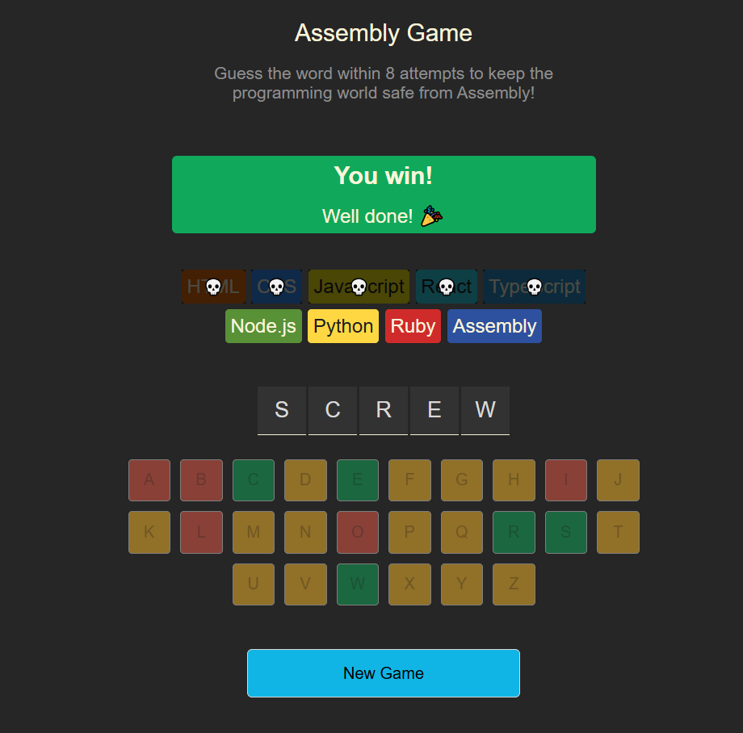
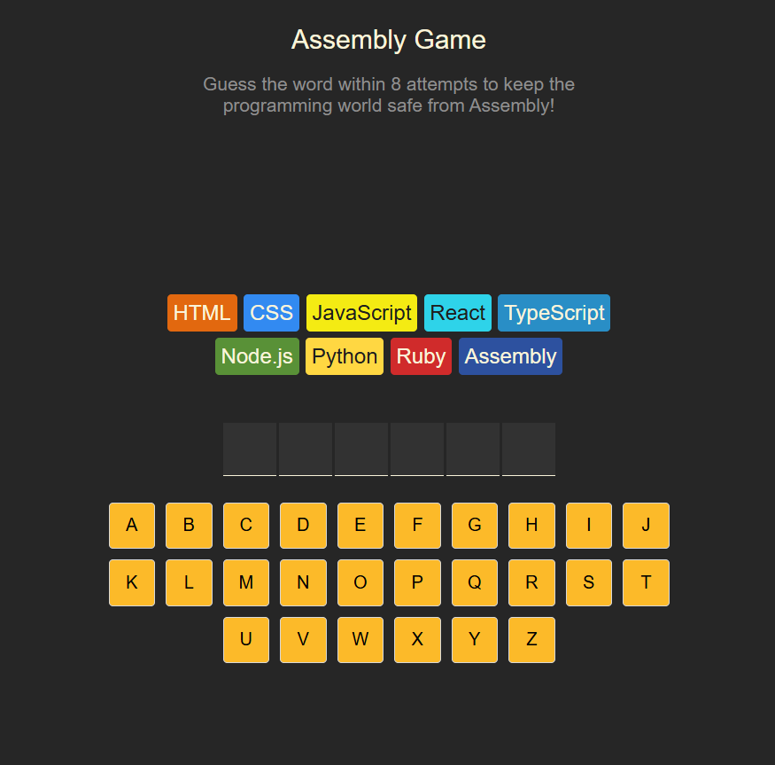

# 🧩 Assembly Game: Save the World from Assembly!

[](https://react.dev/)
[](https://vitejs.dev/)
[](https://javascript.info/)
[](https://pages.github.com/)

An interactive, programming-themed word guessing game. Your mission is to guess the word letter by letter. Every wrong guess "kills" a programming language. If all languages are gone, you're forced to write in **Assembly**!

**[🎮 Play the Live Demo Here!](https://Muhammad-Zubair796.github.io/Puzzule-React-Game/)**

---

## 📸 Game Preview

| Game in Progress | Game Over State |
| :---: | :---: |
|  |  |

---

## 🚀 Key Features

* **Interactive Virtual Keyboard:** Tracks your guesses with real-time color feedback (Green for Correct, Red for Wrong).
* **Visual Life System:** Watch as languages like JavaScript, Python, and Ruby disappear with every mistake.
* **Dynamic Word Reveal:** If you lose, the game automatically reveals the letters you missed in red.
* **Celebration Logic:** Integrated `canvas-confetti` library to celebrate your wins.
* **Screen Reader Accessible:** Built with ARIA live regions and semantic HTML.
* **Responsive Design:** Fully optimized for mobile and desktop screens.

---

## 🛠️ Technical Implementation

### State Management
The game uses React `useState` hooks to track `currentWord` and the list of `guessedLetters`.

### Logic & Effects
* **Derived State:** Variables like `wrongGuessCount` and `isGameOver` are calculated on every render.
* **Side Effects:** The `useEffect` hook monitors the game status to trigger the confetti celebration at the exact moment of victory.
* **Conditional Styling:** Uses the `clsx` utility to manage complex CSS class logic.

---

## 📂 Project Structure

```text
src/
├── components/     # React components
├── languages.js    # Data for the programming languages
├── words.js        # The list of possible secret words
├── utils.js        # Helper functions
└── App.jsx         # Main game logic and state
